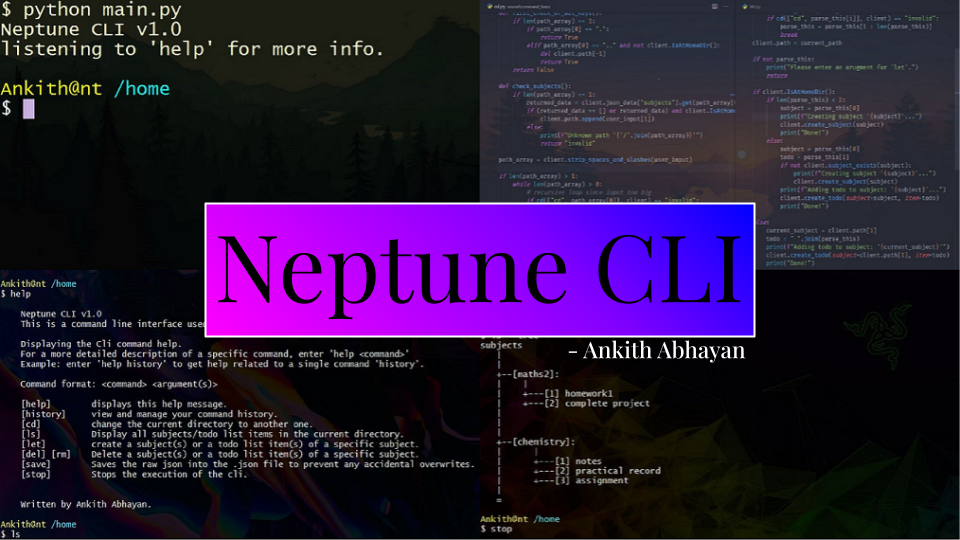
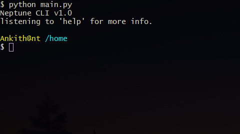
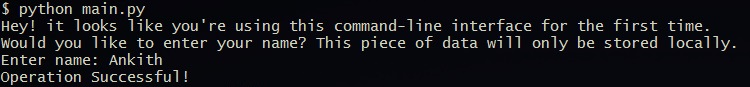

# Neptune CLI
  
The wonderful command-line interface written by Ankith Abhayan (that's me!) for creating a todo list.
- Create and Manage subjects.
- Manage subject specific todo list items.
- List out the Todo list subject-wise or the whole thing. You can view it as a tree if you want to.
- Change directories to get a more specific output for commands like 'ls'.
- Take a closer look and manage your command history.
- Save your todo list for later reference.

## Requirements
- Python 3.8 or newer.  
- git (optional)
  
## Installation
- [click here](releases) to download the latest stable version from the releases section of the repo.
- If you're drunk this wonderful evening, follow the steps below (using git) to download.  

**Note**: I directly commit to master, you can already guess how good the code quality will be if you follow the steps below.  
```bash
git clone 'https://github.com/AnkithAbhayan/Neptune_Cli' neptune_cli
cd neptune_cli
python main.py
```  

## Getting started  
- Neptune cli, on startup should look a little something like this:  
  
- The os name will be subject to change according to what you're using. But you get to choose your username.
- Which is why when you run Neptune cli for the first time, it prompts for your name, as can be seen from the picture below.  
  
- Enter your name when you see this. (your name will only be saved locally in a json file)
- Sweet! Now you're ready to create and manage todo lists.

[repo]: "https://github.com/AnkithAbhayan/Neptune_Cli"
[releases]: "https://github.com/AnkithAbhayan/Neptune_Cli/releases"
